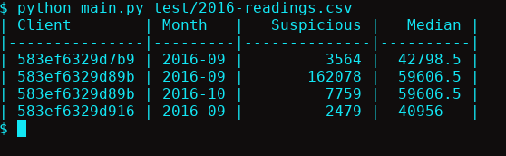

# HolaLuz Prueba
Se har realizado una aplicación usando Python 3 el cual comprobará los datos del fichero que se le indique mediante argumentos de entrada.

## Instalación
Además de tener instalado Python3 en el sistema, para la instalación de la aplicación deberemos ejecutar el siguiente comando en la raíz del proyecto para la instalación de dependencias.

```sh
$ pip3 install -r requirements.txt
```

## Uso de la aplicación
Para usar la aplicación, mediante una shell del sistema, ejecutaremos el fichero Python main.py pasándole como parámetro el fichero (en CSV o XML) que queramos comprobar.
```sh
$ python main.py file.csv
```



También es posible ejecutar el programa como un ejecutable si previamente establecemos los permisos del fichero.
```sh
$ chmod +x main.py
$ ./main.py file.csv
```

## Tests
Se han añadido unos tests unitarios realizados con la librería `unittest`.
Para ejecutar los tests, debemos ejecutar el siguiente comando:
```sh
$ python test/tests.py
```

## Docker
Se ha añadido un fichero Dockerfile por si se desea ejecutar la aplicación dentro de un contenedor Docker y así facilitar la instalación.
Para ejecutarlo dentro de un contenedor, primero costruimos la imagen con el siguiente comando:

```sh
docker build -t holaluz .
```
Y posteriormente creamos el contenedor:
```sh
docker run -dit --name holaluz_container holaluz
docker exec -it holaluz_container bash
```
